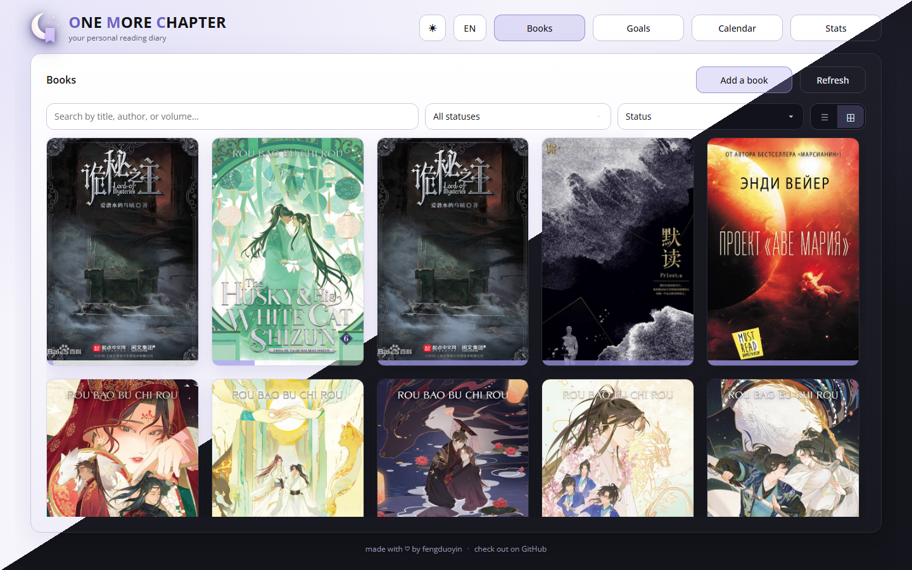
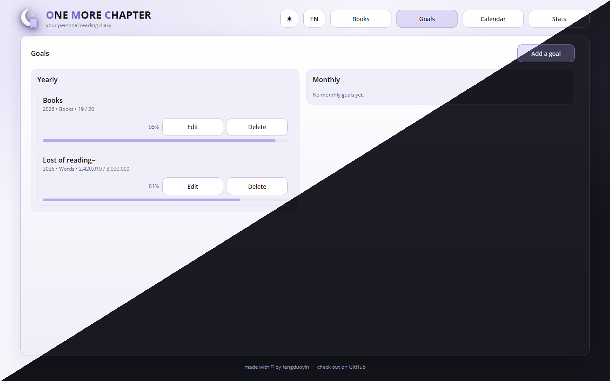
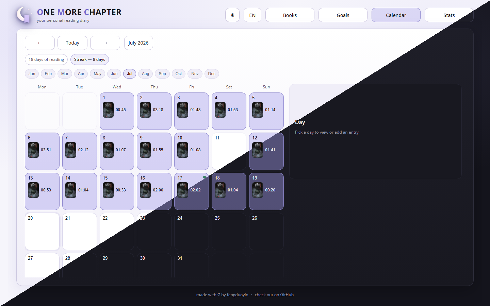
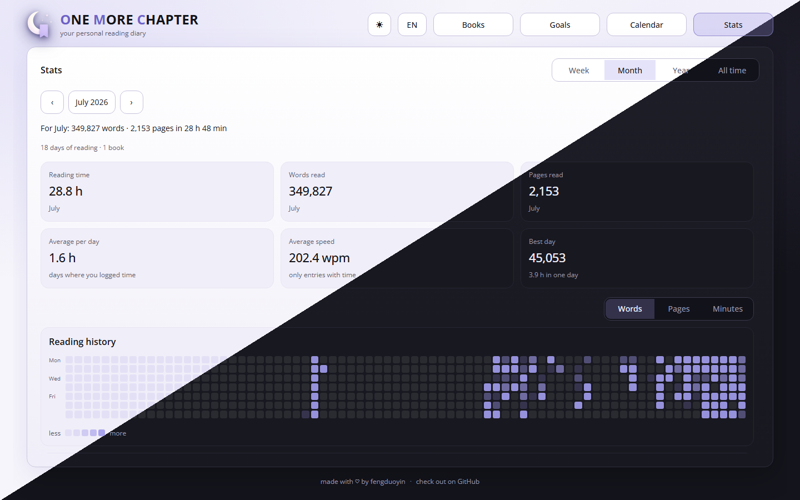

# One More Chapter

Hello! "One More Chapter" is mostly a personal pet-project that I wanted to share with others who might be interested in a reading diary/tracker. You can either grap a portable windows application in releases tab or run a web-application with Docker.

If you encounter bugs or have suggestions regarding features/localization, please, use "Issue" tab of the project.

## Features

- **Books** — library with covers, progress, statuses (want to read / reading / finished / dropped)
- **Goals** — monthly or yearly targets for words, pages, or books
- **Calendar** — daily entries, streaks, finished-book markers
- **Stats** — period summaries, reading calendar, monthly charts
- **Russian & English**, dark and light themes

## Screenshots

| **Books** | **Goals** |
| --- | --- |
|  |  |
| **Calendar** | **Stats** |
|  |  |

See all [screenshots](images/screenshots/).

## Installation

### Option A: Docker

**Requirements:** [Docker](https://docs.docker.com/get-docker/) and Docker Compose.

```bash
git clone https://github.com/fengduoyin/one_more_chapter.git one_more_chapter
cd one_more_chapter
docker compose up --build
```

Open [http://localhost:3050](http://localhost:3050).

Data on the host:

| Path | Contents |
| ---- | -------- |
| `data/ocm_db.db` | SQLite database |
| `data/uploads/` | Cover images |

Backup: copy the whole `data/` folder.

Defaults are enough to run — no `.env` file is required.

### Option B: Windows portable

1. Download a release ZIP (or build one — see below).
2. Unpack anywhere.
3. Run `Start.bat` or `One More Chapter.exe`.

No Docker or Python on the target PC is required for portable version. Data lives next to the app (`data/`, `uploads/`). Windows needs WebView2 (usually already installed with Edge). SmartScreen may warn about an unsigned build, in which case go *More info* → *Run anyway*.

CI: `.github/workflows/build-portable-windows.yml` (manual dispatch or tags `v*`).

**Build the ZIP yourself**

From WSL/Linux:

```bash
./scripts/build_portable_windows.sh
INCLUDE_DATA=1 ./scripts/build_portable_windows.sh   # optional: include existing library
```

On Windows (PowerShell):

```powershell
.\scripts\build_portable.ps1
.\scripts\build_portable.ps1 -IncludeData
```

Output: `dist/OneMoreChapter-portable-win64/` and a dated `.zip`.

## Development

Dev stack is the same Compose file (`Dockerfile.dev`): backend and frontend are mounted into the container.

```bash
docker compose up --build
```

- **Backend** — uvicorn reload on Python changes
- **Frontend** — rebuilt when the container starts; after UI edits:

```bash
docker compose restart app
```

Rebuild the image after dependency changes (`backend/requirements.txt`, `frontend/package.json` / lockfile):

```bash
docker compose up --build
```

Schema is created automatically on startup.

**Local portable window** (pywebview, data under `portable/`):

```bash
./scripts/run_portable.sh
```

If port 3050 is taken by Compose, use `APP_PORT=3051 ./scripts/run_portable.sh`.
